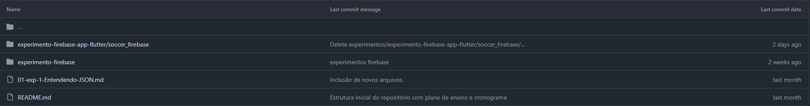

# Regras de arquitetura "Padrão"
1. Frontend não "conversa" diretamente com firestore (Banco)
2. Regras de Negócio ficam no backend Functions.
3. Cada Function deve realizar um único serviço.
4. Planejar muito bem cada Function, pois, baixa performance ou código lent, custa mais caro.
#
# Functions 
Escrevemos o código em TypeScript (preferencialmente), JavaScript ou Python. Cuidado com o ciclo de vida de uma function

                ---------               Resposta
    ==========> |   F   | =========>    
                ---------            "End / Destroy"
    Requisição  Processing          
    "Start"       
    A cada invocação o custo significa "subir", "fazer", "finalizar"
#
# Atividade
1. Acessar o canal do professor (Eletrizuados) e entre na playlist de "Firebase Functions e Firestore"
2. Depois de assistir a playlist e fazer o que a playlist pede. Acessar a página de experimentos de "SI-Estudos-BD-2 e estudar o código index.ts.
    
3. Comparar e entender os custos do uso do firebase Plano Blaze.